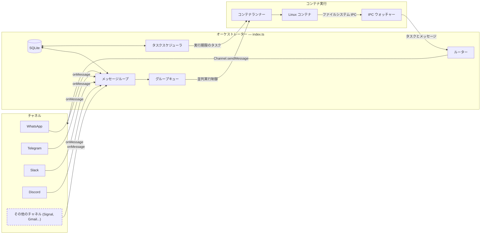

# NanoClaw 仕様書

マルチチャネル対応、会話ごとの永続メモリ、定期実行タスク、およびコンテナで隔離されたエージェント実行を備えた、個人用の Claude アシスタント。

---

## 目次

1. [アーキテクチャ](#architecture)
2. [アーキテクチャ: チャネルシステム](#architecture-channel-system)
3. [フォルダ構造](#folder-structure)
4. [設定](#configuration)
5. [メモリシステム](#memory-system)
6. [セッション管理](#session-management)
7. [メッセージフロー](#message-flow)
8. [コマンド](#commands)
9. [定期実行タスク](#scheduled-tasks)
10. [MCP サーバー](#mcp-servers)
11. [デプロイ](#deployment)
12. [セキュリティ上の考慮事項](#security-considerations)

---

## アーキテクチャ

```
┌──────────────────────────────────────────────────────────────────────┐
│                        ホスト (macOS / Linux)                         │
│                     (メイン Node.js プロセス)                          │
├──────────────────────────────────────────────────────────────────────┤
│                                                                      │
│  ┌──────────────────┐                  ┌─────────────────────┐       │
│  │ チャネル          │─────────────────▶│   SQLite データベース  │       │
│  │ (起動時に自己登録)  │◀────────────────│   (messages.db)      │       │
│  └──────────────────┘  保存/送信        └─────────┬───────────┘        │
│                                                   │                   │
│                                                   │                   │
│         ┌─────────────────────────────────────────┘                   │
│         │                                                             │
│         ▼                                                             │
│  ┌────────────────────┐    ┌──────────────────┐    ┌────────────────┐ │
│  │ メッセージループ      │    │ スケジューラループ   │    │  IPC ウォッチャー│ │
│  │ (SQLite をポーリング)│    │ (タスクを確認)     │    │ (ファイルベース)  │ │
│  └────────┬───────────┘    └────────┬─────────┘    └────────────────┘ │
│           │                         │                                 │
│           └───────────┬───────────┘                                   │
│                       │ コンテナを起動                                  │
│                       ▼                                               │
├───────────────────────────────────────────────────────────────────────┤
│                     コンテナ (Linux VM)                                │
├───────────────────────────────────────────────────────────────────────┤
│  ┌──────────────────────────────────────────────────────────────┐     │
│  │                    エージェントランナー                          │     │
│  │                                                              │     │
│  │  作業ディレクトリ: /workspace/group (ホストからマウント)            │    │
│  │  ボリュームマウント:                                            │     │
│  │    • groups/{name}/ → /workspace/group                       │     │
│  │    • groups/global/ → /workspace/global/ (メイン以外のみ)      │     │
│  │    • data/sessions/{group}/.claude/ → /home/node/.claude/    │     │
│  │    • 追加ディレクトリ → /workspace/extra/*                      │     │
│  │                                                              │     │
│  │  ツール (全グループ共通):                                       │      │
│  │    • Bash (安全 - コンテナ内でサンドボックス化!)                  │      │
│  │    • Read, Write, Edit, Glob, Grep (ファイル操作)              │     │
│  │    • WebSearch, WebFetch (インターネットアクセス)               │      │
│  │    • agent-browser (ブラウザ自動化)                            │     │
│  │    • mcp__nanoclaw__* (IPC 経由のスケジューラツール)             │     │
│  │                                                              │     │
│  └──────────────────────────────────────────────────────────────┘     │
│                                                                       │
└───────────────────────────────────────────────────────────────────────┘
```

### テクノロジースタック

| コンポーネント | テクノロジー | 目的 |
|-----------|------------|---------|
| チャネルシステム | チャネルレジストリ (`src/channels/registry.ts`) | 起動時に各チャネルが自己登録を行う |
| メッセージ保存 | SQLite (better-sqlite3) | ポーリング用にメッセージを保存する |
| コンテナランタイム | コンテナ (Linux VM) | エージェント実行のための隔離された環境 |
| エージェント | @anthropic-ai/claude-agent-sdk (0.2.29) | ツールや MCP サーバーを備えた Claude を実行する |
| ブラウザ自動化 | agent-browser + Chromium | ウェブ操作とスクリーンショット取得 |
| ランタイム | Node.js 20+ | ルーティングとスケジューリングのためのホストプロセス |

---

## アーキテクチャ: チャネルシステム

コアにはチャネルが組み込まれていません。各チャネル（WhatsApp, Telegram, Slack, Discord, Gmail）は [Claude Code スキル](https://code.claude.com/docs/en/skills) としてインストールされ、フォークにチャネルコードを追加します。チャネルは起動時に自己登録されます。インストール済みで認証情報が不足しているチャネルは、WARN ログを出力してスキップされます。

### システム図



### チャネルレジストリ

チャネルシステムは、`src/channels/registry.ts` にあるファクトリレジストリに基づいています：

```typescript
export type ChannelFactory = (opts: ChannelOpts) => Channel | null;

const registry = new Map<string, ChannelFactory>();

export function registerChannel(name: string, factory: ChannelFactory): void {
  registry.set(name, factory);
}

export function getChannelFactory(name: string): ChannelFactory | undefined {
  return registry.get(name);
}

export function getRegisteredChannelNames(): string[] {
  return [...registry.keys()];
}
```

各ファクトリは `ChannelOpts`（`onMessage`, `onChatMetadata`, `registeredGroups` のためのコールバック）を受け取り、`Channel` インスタンス、または認証情報が設定されていない場合は `null` を返します。

### チャネルインターフェース

すべてのチャネルは、以下のインターフェース（`src/types.ts` で定義）を実装します：

```typescript
interface Channel {
  name: string;
  connect(): Promise<void>;
  sendMessage(jid: string, text: string): Promise<void>;
  isConnected(): boolean;
  ownsJid(jid: string): boolean;
  disconnect(): Promise<void>;
  setTyping?(jid: string, isTyping: boolean): Promise<void>;
  syncGroups?(force: boolean): Promise<void>;
}
```

### 自己登録パターン

チャネルはバレルインポート・パターンを使用して自己登録します：

1. 各チャネルスキルは `src/channels/` にファイル（例： `whatsapp.ts`, `telegram.ts`）を追加し、モジュールのロード時に `registerChannel()` を呼び出します：

   ```typescript
   // src/channels/whatsapp.ts
   import { registerChannel, ChannelOpts } from './registry.js';

   export class WhatsAppChannel implements Channel { /* ... */ }

   registerChannel('whatsapp', (opts: ChannelOpts) => {
     // 認証情報がない場合は null を返す
     if (!existsSync(authPath)) return null;
     return new WhatsAppChannel(opts);
   });
   ```

2. バレルファイル `src/channels/index.ts` がすべてのチャネルモジュールをインポートし、登録をトリガーします：

   ```typescript
   import './whatsapp.js';
   import './telegram.js';
   // ... 各スキルがここにインポートを追加
   ```

3. 起動時に、オーケストレーター (`src/index.ts`) が登録済みチャネルをループし、有効なインスタンスを返すものを接続します：

   ```typescript
   for (const name of getRegisteredChannelNames()) {
     const factory = getChannelFactory(name);
     const channel = factory?.(channelOpts);
     if (channel) {
       await channel.connect();
       channels.push(channel);
     }
   }
   ```

### 主要ファイル

| ファイル | 目的 |
|------|---------|
| `src/channels/registry.ts` | チャネルファクトリレジストリ |
| `src/channels/index.ts` | チャネルの自己登録をトリガーするバレルインポート |
| `src/types.ts` | `Channel` インターフェース、`ChannelOpts`、メッセージ型 |
| `src/index.ts` | オーケストレーター — チャネルのインスタンス化、メッセージループの実行 |
| `src/router.ts` | JID に対応するチャネルの特定、メッセージのフォーマット |

### 新しいチャネルの追加

新しいチャネルを追加するには、`.claude/skills/add-<name>/` に以下のスキルを提供します：

1. `Channel` インターフェースを実装した `src/channels/<name>.ts` ファイルを追加する
2. モジュールロード時に `registerChannel(name, factory)` を呼び出す
3. 認証情報がない場合はファクトリから `null` を返す
4. `src/channels/index.ts` にインポート行を追加する

既存のスキル (`/add-whatsapp`, `/add-telegram`, `/add-slack`, `/add-discord`, `/add-gmail`) のパターンを参考にしてください。

---

## フォルダ構造

```
nanoclaw/
├── CLAUDE.md                      # Claude Code 用のプロジェクトコンテキスト
├── docs/
│   ├── SPEC.md                    # この仕様書ドキュメント
│   ├── REQUIREMENTS.md            # アーキテクチャ決定事項
│   └── SECURITY.md                # セキュリティモデル
├── README.md                      # ユーザー向けドキュメント
├── package.json                   # Node.js 依存関係
├── tsconfig.json                  # TypeScript 設定
├── .mcp.json                      # MCP サーバー設定 (リファレンス)
├── .gitignore
│
├── src/
│   ├── index.ts                   # オーケストレーター: 状態、メッセージループ、エージェント呼び出し
│   ├── channels/
│   │   ├── registry.ts            # チャネルファクトリレジストリ
│   │   └── index.ts               # チャネル自己登録のためのバレルインポート
│   ├── ipc.ts                     # IPC ウォッチャーとタスク処理
│   ├── router.ts                  # メッセージフォーマットと送信ルーティング
│   ├── config.ts                  # 設定定数
│   ├── types.ts                   # TypeScript インターフェース (Channel を含む)
│   ├── logger.ts                  # Pino ロガー設定
│   ├── db.ts                      # SQLite データベースの初期化とクエリ
│   ├── group-queue.ts             # グローバルな並列実行制限を持つグループごとのキュー
│   ├── mount-security.ts          # コンテナのマウント許可リスト検証
│   ├── whatsapp-auth.ts           # スタンドアロンの WhatsApp 認証
│   ├── task-scheduler.ts          # 実行期限が来たタスクを実行する
│   └── container-runner.ts        # コンテナ内でエージェントを起動する
│
├── container/
│   ├── Dockerfile                 # コンテナイメージ ('node' ユーザーで実行、Claude Code CLI を含む)
│   ├── build.sh                   # コンテナイメージのビルドスクリプト
│   ├── agent-runner/              # コンテナ内で実行されるコード
│   │   ├── package.json
│   │   ├── tsconfig.json
│   │   └── src/
│   │       ├── index.ts           # エントリポイント (クエリーループ、IPC ポーリング、セッション再開)
│   │       └── ipc-mcp-stdio.ts   # ホスト通信用の stdio ベース MCP サーバー
│   └── skills/
│       └── agent-browser.md       # ブラウザ自動化スキル
│
├── dist/                          # コンパイル済み JavaScript (gitignored)
│
├── .claude/
│   └── skills/
│       ├── setup/SKILL.md              # /setup - 初回インストール
│       ├── customize/SKILL.md          # /customize - 機能の追加
│       ├── debug/SKILL.md              # /debug - コンテナのデバッグ
│       ├── add-telegram/SKILL.md       # /add-telegram - Telegram チャネル
│       ├── add-gmail/SKILL.md          # /add-gmail - Gmail 連携
│       ├── add-voice-transcription/    # /add-voice-transcription - Whisper
│       ├── x-integration/SKILL.md      # /x-integration - X/Twitter
│       ├── convert-to-apple-container/  # /convert-to-apple-container - Apple Container ランタイム
│       └── add-parallel/SKILL.md       # /add-parallel - 並列エージェント
│
├── groups/
│   ├── CLAUDE.md                  # グローバルメモリ (すべてのグループが読み込む)
│   ├── {channel}_main/             # メインコントロールチャネル (例: whatsapp_main/)
│   │   ├── CLAUDE.md              # メインチャネルのメモリ
│   │   └── logs/                  # タスク実行ログ
│   └── {channel}_{group-name}/    # グループごとのフォルダ (登録時に作成)
│       ├── CLAUDE.md              # グループ固有のメモリ
│       ├── logs/                  # このグループのタスクログ
│       └── *.md                   # エージェントによって作成されたファイル
│
├── store/                         # ローカルデータ (gitignored)
│   ├── auth/                      # WhatsApp 認証ステート
│   └── messages.db                # SQLite データベース (メッセージ、チャット、タスク、ログ、登録済みグループ、セッション、ルーターステート)
│
├── data/                          # アプリケーションステート (gitignored)
│   ├── sessions/                  # グループごとのセッションデータ (JSONL 形式の履歴を含む .claude/ ディレクトリ)
│   ├── env/env                    # コンテナマウント用の .env のコピー
│   └── ipc/                       # コンテナ IPC (messages/, tasks/)
│
├── logs/                          # 実行ログ (gitignored)
│   ├── nanoclaw.log               # ホストの標準出力
│   └── nanoclaw.error.log         # ホストの標準エラー出力
│   # 注: コンテナごとのログは groups/{folder}/logs/container-*.log に保存されます
│
└── launchd/
    └── com.nanoclaw.plist         # macOS サービス設定
```

---

## 設定

設定定数は `src/config.ts` にあります：

```typescript
import path from 'path';

export const ASSISTANT_NAME = process.env.ASSISTANT_NAME || 'Andy';
export const POLL_INTERVAL = 2000;
export const SCHEDULER_POLL_INTERVAL = 60000;

// パスは絶対パス（コンテナマウントに必要）
const PROJECT_ROOT = process.cwd();
export const STORE_DIR = path.resolve(PROJECT_ROOT, 'store');
export const GROUPS_DIR = path.resolve(PROJECT_ROOT, 'groups');
export const DATA_DIR = path.resolve(PROJECT_ROOT, 'data');

// コンテナ設定
export const CONTAINER_IMAGE = process.env.CONTAINER_IMAGE || 'nanoclaw-agent:latest';
export const CONTAINER_TIMEOUT = parseInt(process.env.CONTAINER_TIMEOUT || '1800000', 10); // デフォルト 30分
export const IPC_POLL_INTERVAL = 1000;
export const IDLE_TIMEOUT = parseInt(process.env.IDLE_TIMEOUT || '1800000', 10); // 30分 — 最後に出力があってからコンテナを維持する時間
export const MAX_CONCURRENT_CONTAINERS = Math.max(1, parseInt(process.env.MAX_CONCURRENT_CONTAINERS || '5', 10) || 5);

export const TRIGGER_PATTERN = new RegExp(`^@${ASSISTANT_NAME}\\b`, 'i');
```

**注：** コンテナのボリュームマウントを正しく機能させるには、絶対パスを使用する必要があります。

### コンテナ設定

グループには、SQLite の `registered_groups` テーブルの `containerConfig`（`container_config` カラムに JSON として保存）を介して、追加のディレクトリをマウントできます。登録の例：

```typescript
setRegisteredGroup("1234567890@g.us", {
  name: "Dev Team",
  folder: "whatsapp_dev-team",
  trigger: "@Andy",
  added_at: new Date().toISOString(),
  containerConfig: {
    additionalMounts: [
      {
        hostPath: "~/projects/webapp",
        containerPath: "webapp",
        readonly: false,
      },
    ],
    timeout: 600000,
  },
});
```

フォルダ名は `{channel}_{group-name}` の慣習に従います（例： `whatsapp_family-chat`, `telegram_dev-team`）。メイングループは登録時に `isMain: true` が設定されます。

追加マウントは、コンテナ内の `/workspace/extra/{containerPath}` に表示されます。

**マウント構文の注意：** 読み書きマウントは `-v host:container` を使用しますが、読み取り専用マウントは `--mount "type=bind,source=...,target=...,readonly"` が必要です（`:ro` サフィックスはすべてのランタイムで動作するとは限りません）。

### Claude 認証

プロジェクトルートの `.env` ファイルで認証を設定します。2 つのオプションがあります：

**オプション 1: Claude サブスクリプション (OAuth トークン)**
```bash
CLAUDE_CODE_OAUTH_TOKEN=sk-ant-oat01-...
```
トークンは、Claude Code にログインしている場合に `~/.claude/.credentials.json` から抽出できます。

**オプション 2: 従量課金 API キー**
```bash
ANTHROPIC_API_KEY=sk-ant-api03-...
```

認証変数（`CLAUDE_CODE_OAUTH_TOKEN` および `ANTHROPIC_API_KEY`）のみが `.env` から抽出されて `data/env/env` に書き込まれ、コンテナの `/workspace/env-dir/env` にマウントされてエントリポイントスクリプトによって読み込まれます。これにより、`.env` 内の他の環境変数がエージェントにさらされるのを防ぎます。この回避策が必要な理由は、一部のコンテナランタイムにおいて `-i`（パイプされた stdin を使用する対話モード）を使用すると `-e` 環境変数が失われるためです。

### アシスタント名の変更

`ASSISTANT_NAME` 環境変数を設定します：

```bash
ASSISTANT_NAME=Bot npm start
```

または `src/config.ts` のデフォルト値を編集します。これにより以下が変更されます：
- トリガーパターン（メッセージは `@YourName` で始まる必要があります）
- レスポンスのプレフィックス（`YourName:` が自動的に付与されます）

### launchd のプレースホルダー値

`{{PLACEHOLDER}}` 値を持つファイルは設定が必要です：
- `{{PROJECT_ROOT}}` - nanoclaw がインストールされている絶対パス
- `{{NODE_PATH}}` - node バイナリのパス (`which node` で確認)
- `{{HOME}}` - ユーザーのホームディレクトリ

---

## メORY システム

NanoClaw は、CLAUDE.md ファイルに基づいた階層的なメモリシステムを使用します。

### メモリ階層

| レベル | 場所 | 読み取り | 書き込み | 目的 |
|-------|----------|---------|------------|---------|
| **グローバル** | `groups/CLAUDE.md` | すべてのグループ | メインのみ | 設定、事実、すべての会話で共有されるコンテキスト |
| **グループ** | `groups/{name}/CLAUDE.md` | そのグループ | そのグループ | グループ固有のコンテキスト、会話のメモリ |
| **ファイル** | `groups/{name}/*.md` | そのグループ | そのグループ | 会話中に作成されたノート、調査、ドキュメント |

### メモリの仕組み

1. **エージェントコンテキストのロード**
   - エージェントは `cwd`（カレントディレクトリ）を `groups/{group-name}/` に設定して実行されます
   - Claude Agent SDK は `settingSources: ['project']` により、以下を自動的にロードします：
     - `../CLAUDE.md` (親ディレクトリ = グローバルメモリ)
     - `./CLAUDE.md` (カレントディレクトリ = グループメモリ)

2. **メモリの書き込み**
   - ユーザーが「これを覚えておいて」と言うと、エージェントは `./CLAUDE.md` に書き込みます
   - ユーザーが「これをグローバルに覚えておいて」と言うと（メインチャネルのみ）、エージェントは `../CLAUDE.md` に書き込みます
   - エージェントはグループフォルダ内に `notes.md` や `research.md` などのファイルを作成できます

3. **メインチャネルの特権**
   - 「メイン」グループ（自分自身とのチャット）のみがグローバルメモリに書き込めます
   - メインは登録済みグループの管理や、任意のグループのタスクのスケジュールを行えます
   - メインは任意のグループに対して追加のディレクトリマウントを設定できます
   - すべてのグループが Bash アクセス権を持ちます（コンテナ内で実行されるため安全です）

---

## セッション管理

セッションにより会話の継続性が確保されます。Claude は以前に話した内容を記憶します。

### セッションの仕組み

1. 各グループは SQLite に保存されたセッション ID を持ちます（`sessions` テーブル、キーは `group_folder`）
2. セッション ID は Claude Agent SDK の `resume` オプションに渡されます
3. Claude は完全なコンテキストを持って会話を継続します
4. セッションの履歴は `data/sessions/{group}/.claude/` に JSONL ファイルとして保存されます

---

## メッセージフロー

### 受信メッセージフロー

```
1. ユーザーがいずれかの接続済みチャネルを介してメッセージを送信
   │
   ▼
2. チャネルがメッセージを受信 (例: WhatsApp なら Baileys、Telegram なら Bot API)
   │
   ▼
3. メッセージが SQLite に保存される (store/messages.db)
   │
   ▼
4. メッセージループが SQLite をポーリング (2秒ごと)
   │
   ▼
5. ルーターがチェック：
   ├── chat_jid は登録済みグループ (SQLite) か？ → No: 無視
   └── メッセージはトリガーパターンに一致するか？ → No: 保存するが処理はしない
   │
   ▼
6. ルーターが会話を追いつかせる：
   ├── 最後のエージェント応答以降のすべてのメッセージを取得
   ├── タイムスタンプと送信者名でフォーマット
   └── 会話コンテキスト全体を含めたプロンプトを構築
   │
   ▼
7. ルーターが Claude Agent SDK を呼び出し：
   ├── cwd: groups/{group-name}/
   ├── prompt: 会話履歴 + 現在のメッセージ
   ├── resume: session_id (継続性のため)
   └── mcpServers: nanoclaw (スケジューラ)
   │
   ▼
8. Claude がメッセージを処理：
   ├── コンテキストとして CLAUDE.md ファイルを読み込む
   └── 必要に応じてツールを使用 (検索、メールなど)
   │
   ▼
9. ルーターがレスポンスにアシスタント名を付与し、対象のチャネル経由で送信
   │
   ▼
10. ルーターが最後のエージェントタイムスタンプを更新し、セッション ID を保存
```

### トリガーワードの照合

メッセージはトリガーパターン（デフォルト： `@Andy`）で始まる必要があります：
- `@Andy 天気はどう？` → ✅ Claude が反応
- `@andy 助けて` → ✅ 反応（大文字小文字を区別しない）
- `ねえ @Andy` → ❌ 無視（トリガーが先頭にない）
- `元気？` → ❌ 無視（トリガーなし）

### 会話のキャッチアップ

トリガーメッセージが届くと、エージェントはそのチャットでの前回の対話以降のすべてのメッセージを受け取ります。各メッセージはタイムスタンプと送信者名でフォーマットされます：

```
[1月31日 2:32 PM] John: みんな、今夜はピザにしない？
[1月31日 2:33 PM] Sarah: いいね
[1月31日 2:35 PM] John: @Andy どのおすすめのトッピングがある？
```

これにより、エージェントはすべてのメッセージで言及されていなくても、会話のコンテキストを理解できます。

---

## コマンド

### どのグループでも使用可能なコマンド

| コマンド | 例 | 効果 |
|---------|---------|--------|
| `@Assistant [メッセージ]` | `@Andy 天気はどう？` | Claude と話す |

### メインチャネルでのみ使用可能なコマンド

| コマンド | 例 | 効果 |
|---------|---------|--------|
| `@Assistant add group "名前"` | `@Andy add group "家族チャット"` | 新しいグループを登録する |
| `@Assistant remove group "名前"` | `@Andy remove group "仕事チーム"` | グループの登録を解除する |
| `@Assistant list groups` | `@Andy list groups` | 登録済みグループを表示する |
| `@Assistant remember [事実]` | `@Andy remember 私はダークモードが好きです` | グローバルメモリに追加する |

---

## 定期実行タスク

NanoClaw は、グループのコンテキスト内でフル機能のエージェントとしてタスクを実行するビルトインスケジューラを備えています。

### スケジューリングの仕組み

1. **グループコンテキスト**: グループ内で作成されたタスクは、そのグループの作業ディレクトリとメモリを使用して実行されます。
2. **フルエージェント機能**: 定期実行タスクはすべてのツール（WebSearch、ファイル操作など）にアクセスできます。
3. **オプションのメッセージ送信**: タスクは `send_message` ツールを使用してグループにメッセージを送信することも、サイレントに完了することもできます。
4. **メインチャネルの特権**: メインチャネルは任意のグループのタスクをスケジュールし、すべてのタスクを表示できます。

### スケジュールタイプ

| タイプ | 値の形式 | 例 |
|------|--------------|---------|
| `cron` | Cron 式 | `0 9 * * 1` (月曜日の午前9時) |
| `interval` | ミリ秒 | `3600000` (1時間ごと) |
| `once` | ISO タイムスタンプ | `2024-12-25T09:00:00Z` |

### タスクの作成

```
ユーザー: @Andy 毎週月曜の午前9時に、週次メトリクスを確認するようリマインドして

Claude: [mcp__nanoclaw__schedule_task を呼び出し]
        {
          "prompt": "週次メトリクスの確認をリマインドしてください。励ますような感じで！",
          "schedule_type": "cron",
          "schedule_value": "0 9 * * 1"
        }

Claude: 了解しました！毎週月曜の午前9時にリマインドします。
```

### 単発タスク

```
ユーザー: @Andy 今日の午後5時に、今日のメールの要約を送って

Claude: [mcp__nanoclaw__schedule_task を呼び出し]
        {
          "prompt": "今日のメールを検索し、重要なものを要約してグループに送信してください。",
          "schedule_type": "once",
          "schedule_value": "2024-01-31T17:00:00Z"
        }
```

### タスクの管理

どのグループからでも：
- `@Andy list my scheduled tasks` - このグループのタスクを表示
- `@Andy pause task [id]` - タスクを一時停止
- `@Andy resume task [id]` - 一時停止中のタスクを再開
- `@Andy cancel task [id]` - タスクを削除

メインチャネルから：
- `@Andy list all tasks` - すべてのグループのタスクを表示
- `@Andy schedule task for "家族チャット": [プロンプト]` - 他のグループのタスクをスケジュール

---

## MCP サーバー

### NanoClaw MCP (ビルトイン)

`nanoclaw` MCP サーバーは、現在のグループのコンテキストを使用してエージェント呼び出しごとに動的に作成されます。

**利用可能なツール：**
| ツール | 目的 |
|------|---------|
| `schedule_task` | 定期実行または単発のタスクをスケジュールする |
| `list_tasks` | タスクを表示する（グループ内、またはメインならすべて） |
| `get_task` | タスクの詳細と実行履歴を取得する |
| `update_task` | タスクのプロンプトやスケジュールを修正する |
| `pause_task` | タスクを一時停止する |
| `resume_task` | 一時停止中のタスクを再開する |
| `cancel_task` | タスクを削除する |
| `send_message` | チャネル経由でグループにメッセージを送信する |

---

## デプロイ

NanoClaw は単一の macOS launchd サービスとして実行されます。

### 起動シーケンス

NanoClaw が起動すると：
1. **コンテナランタイムが実行されていることを確認** - 必要に応じて自動的に起動し、以前の実行から残っている孤立したコンテナを終了します。
2. SQLite データベースを初期化します（JSON ファイルがあればマイグレーションします）。
3. SQLite からステートをロードします（登録済みグループ、セッション、ルーターステート）。
4. **チャネルを接続** — 登録済みチャネルをループし、認証情報があるものをインスタンス化して `connect()` を呼び出します。
5. 少なくとも 1 つのチャネルが接続されたら：
   - スケジューラループを開始
   - コンテナメッセージ用の IPC ウォッチャーを開始
   - `processGroupMessages` でグループごとのキューをセットアップ
   - シャットダウン前に未処理だったメッセージを復旧
   - メッセージポーリングループを開始

### サービス: com.nanoclaw

**launchd/com.nanoclaw.plist:**
```xml
<?xml version="1.0" encoding="UTF-8"?>
<!DOCTYPE plist PUBLIC "-//Apple//DTD PLIST 1.0//EN" "...">
<plist version="1.0">
<dict>
    <key>Label</key>
    <string>com.nanoclaw</string>
    <key>ProgramArguments</key>
    <array>
        <string>{{NODE_PATH}}</string>
        <string>{{PROJECT_ROOT}}/dist/index.js</string>
    </array>
    <key>WorkingDirectory</key>
    <string>{{PROJECT_ROOT}}</string>
    <key>RunAtLoad</key>
    <true/>
    <key>KeepAlive</key>
    <true/>
    <key>EnvironmentVariables</key>
    <dict>
        <key>PATH</key>
        <string>{{HOME}}/.local/bin:/usr/local/bin:/usr/bin:/bin</string>
        <key>HOME</key>
        <string>{{HOME}}</string>
        <key>ASSISTANT_NAME</key>
        <string>Andy</string>
    </dict>
    <key>StandardOutPath</key>
    <string>{{PROJECT_ROOT}}/logs/nanoclaw.log</string>
    <key>StandardErrorPath</key>
    <string>{{PROJECT_ROOT}}/logs/nanoclaw.error.log</string>
</dict>
</plist>
```

### サービスの管理

```bash
# サービスをインストール
cp launchd/com.nanoclaw.plist ~/Library/LaunchAgents/

# サービスを開始
launchctl load ~/Library/LaunchAgents/com.nanoclaw.plist

# サービスを停止
launchctl unload ~/Library/LaunchAgents/com.nanoclaw.plist

# ステータスを確認
launchctl list | grep nanoclaw

# ログを表示
tail -f logs/nanoclaw.log
```

---

## セキュリティ上の考慮事項

### コンテナによる隔離

すべてのエージェントはコンテナ（軽量な Linux VM）内で実行され、以下を提供します：
- **ファイルシステムの隔離**: エージェントはマウントされたディレクトリにしかアクセスできません
- **安全な Bash アクセス**: コマンドは Mac 上ではなくコンテナ内で実行されます
- **ネットワークの隔離**: 必要に応じてコンテナごとに設定可能です
- **プロセスの隔離**: コンテナ内のプロセスはホストに影響を与えられません
- **非 root ユーザー**: コンテナは非特権の `node` ユーザー (uid 1000) で実行されます

### プロンプトインジェクションのリスク

メッセージに、Claude の動作を操作しようとする悪意のある指示が含まれている可能性があります。

**緩和策：**
- コンテナによる隔離が影響範囲を限定します
- 登録されたグループのみが処理されます
- トリガーワードが必須です（誤処理を減らします）
- エージェントはそのグループにマウントされたディレクトリにしかアクセスできません
- メインはグループごとに追加のディレクトリを設定できます
- Claude の組み込みの安全性トレーニング

**推奨事項：**
- 信頼できるグループのみを登録してください
- 追加のディレクトリマウントは慎重に確認してください
- 定期実行タスクを定期的に見直してください
- 異常な活動がないかログを監視してください

### 認証情報の保存

| 認証情報 | 保存場所 | 備考 |
|------------|------------------|-------|
| Claude CLI 認証 | data/sessions/{group}/.claude/ | グループごとの隔離、/home/node/.claude/ にマウント |
| WhatsApp セッション | store/auth/ | 自動作成、約20日間持続 |

### ファイルパーミッション

groups/ フォルダには個人のメモリが含まれるため、保護する必要があります：
```bash
chmod 700 groups/
```

---

## トラブルシューティング

### よくある問題

| 問題 | 原因 | 解決策 |
|-------|-------|----------|
| メッセージに反応しない | サービスが実行されていない | `launchctl list | grep nanoclaw` を確認 |
| "Claude Code process exited with code 1" | コンテナランタイムの起動失敗 | ログを確認。自動起動を試みますが失敗することがあります。 |
| "Claude Code process exited with code 1" | セッションのマウントパスの間違い | マウント先が `/home/node/.claude/` であり `/root/.claude/` でないことを確認 |
| セッションが継続しない | セッション ID が保存されていない | SQLite を確認: `sqlite3 store/messages.db "SELECT * FROM sessions"` |
| セッションが継続しない | マウントパスの不一致 | コンテナユーザーは `node` (HOME=/home/node) です。セッションは `/home/node/.claude/` にある必要があります。 |
| "QR code expired" | WhatsApp セッションの期限切れ | store/auth/ を削除して再起動 |
| "No groups registered" | グループが追加されていない | メインチャネルで `@Andy add group "名前"` を使用 |

### ログの場所

- `logs/nanoclaw.log` - 標準出力
- `logs/nanoclaw.error.log` - 標準エラー出力

### デバッグモード

詳細な出力を得るには手動で実行してください：
```bash
npm run dev
# または
node dist/index.js
```
