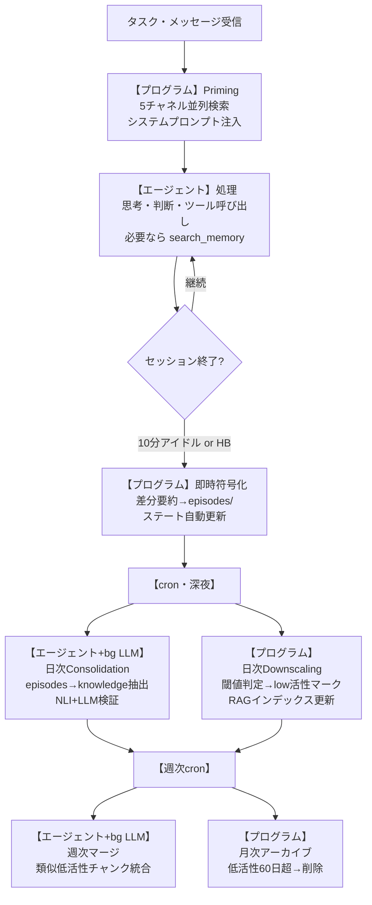

# AnimaWorks 記憶システム総合リファレンス

AnimaWorksのコードベースから読み取れる記憶システムの設計思想、実装詳細、およびエージェント／プログラムの役割分担を統合的にまとめたリファレンス。

---

## 設計哲学

AnimaWorksの設計原則を一言で表すと、**「エージェントは『考える人』であり、記憶インフラの管理者ではない」**。

記憶インフラの管理はフレームワークが担い、符号化・固定化にはバックグラウンドで別途LLMをワンショット呼出しする（エージェント本人のLLMセッションとは独立）。エージェントに「記憶を管理させる」のではなく、エージェントが「記憶を使う」。インフラはフレームワークが持つ。この分離が、設計の出発点になっている。

---

## 7層の記憶システム

AnimaWorksの記憶システムは「人間の脳の記憶モデル」を忠実に再現する設計思想に基づいており、仕様書を読むと **7層** で構成されている（一般的な解説で触れられる5層より深い）。

```
~/.animaworks/animas/{name}/
├── activity_log/    統一アクティビティログ（全インタラクションのJSONL時系列記録）
├── episodes/        エピソード記憶（日次ログ、行動記録）
├── knowledge/       意味記憶（学習済み知識、教訓、方針）
├── procedures/      手続き記憶（作業手順書）
├── skills/          スキル記憶（個人スキル）
├── shortterm/       短期記憶（セッション状態、ストリーミングジャーナル）
└── state/           ワーキングメモリの永続部分（現在タスク、短期記憶）
```

`shortterm/` と `activity_log/` は他の解説ではほとんど触れられない。`shortterm/` はchat会話とheartbeatを分離して継続性を保ち、`activity_log/` はすべてのインタラクションをJSONLで記録する「真実のログ」として機能する。

### 各層のライフサイクル

| 記憶層 | 書き込み | 読み込み | 統合タイミング | 忘却タイミング |
|--------|---------|---------|-------------|-------------|
| `activity_log/` | 全インタラクション時 | Priming Channel B | — | 7日でローテーション |
| `episodes/` | セッション境界時 | Priming fallback | 日次→`knowledge/`へ | 週次圧縮、月次削除 |
| `knowledge/` | 日次consolidation | Priming Channel C（RAG） | 週次dedup&merge | 90日未アクセスでmark |
| `procedures/` | 日次distillation | Priming Channel D | 週次パターン蒸留 | 180日未使用でmark |
| `skills/` | 手動 | Channel D | — | **永久保護** |
| `shortterm/` | ストリーミング中 | セッション継続時 | — | セッション正常終了時に削除 |

### ワーキングメモリ＝コンテキストウィンドウ

Baddeley（2000）のワーキングメモリモデルに基づき、LLMコンテキストウィンドウを「現在注意を向けている長期記憶の部分」として概念化。`ConversationMemory`が会話履歴をローリング圧縮で管理し、50ターンを超えると古いターンをLLMサマリーに圧縮、最近のターンはverbatimで保持する。

### YAMLフロントマターによるメタデータ管理

すべての記憶ファイルに構造化メタデータを自動付与する。

**knowledge/ のフロントマター：**
```yaml
---
created_at: "2026-02-18T03:00:00+09:00"
updated_at: "2026-02-18T03:00:00+09:00"
source_episodes: 3
confidence: 0.9       # NLI+LLM検証スコア（0.0-1.0）
auto_consolidated: true
version: 1            # 再固定化のたびにインクリメント
superseded_by: ""     # 矛盾解決時に置き換えた新ファイル
supersedes: ""        # 矛盾解決時に置き換えた古いファイル
---
```

**procedures/ のフロントマター：**
```yaml
---
description: 手順の説明
confidence: 0.5       # success_count / max(1, success_count + failure_count)
success_count: 0
failure_count: 0
version: 1
created_at: "2026-02-18T03:00:00+09:00"
updated_at: "2026-02-18T03:00:00+09:00"
auto_distilled: true
protected: false
---
```

### エージェント vs プログラムの役割分担

**エージェントの役割：** エージェントに残る書き込み経路は **「意図的記銘」（`write_memory_file`）のみ**。「この情報は長期保存すべきか」を判断し、適切な層へのファイル書き込みを自分で発行する。「どの層に書くか」（エピソードか知識か手続きか）の判断はエージェントの意味理解に委ねる。

**プログラムの役割：** セッション境界の自動検出（10分アイドル or heartbeat到達）→ エピソードへの自動記録、各層のファイル構造の作成・管理、RAGインデックスの増分更新。

**落とし穴：** エージェントに記憶の整理・圧縮・移動まで任せると、思考サイクルが記憶管理に消費され、本来のタスク処理品質が下がる。AnimaWorksがこの設計を避けた理由がここにある。

### 他プロジェクトへの応用

単一のベクターDBや単一のチャット履歴リストで全てを管理しようとするのが最も一般的な失敗パターン。AnimaWorksから学べる最重要設計原則：

1. **エピソード記憶（raw）と意味記憶（distilled）を必ず分離する** — rawログはそのまま保持し、蒸留済み知識は別ストアへ
2. **各記憶タイプに異なるTTL（Time-To-Live）を設定する** — 会話ログは短命、知識は中期、スキルは永続
3. **メタデータに「信頼度」「バージョン」「アクセス頻度」を必ず含める** — 忘却・再統合を可能にする前提条件
4. **スキル記憶（できること一覧）は保護フラグで完全永続化する** — エージェントの能力自体を忘れさせてはならない

```
[設計パターン]
Layer定義 → それぞれにTTL・アクセスポリシーを付与 → 書き込みはエージェント、整理はバッチ

例（カスタマーサポートBot）：
  episodes/   = 個々のチケット対応ログ（30日TTL）
  knowledge/  = FAQから抽出した解決パターン（永続、ただし更新頻度で評価）
  procedures/ = エスカレーション手順（protected: true）
  state/      = 未解決チケット一覧（常時更新）
```

---

## Priming（自動想起）：5チャネル並列検索

### AnimaWorksの実装

**Primingとは「メッセージを受け取った瞬間に、エージェントが思考を開始する前に、関連記憶を自動注入する仕組み」**。

```
メッセージ受信 → キーワード抽出 → 5チャンネル並列検索 → トークン予算内で組み立て → エージェント実行
```

`core/memory/priming.py`の`PrimingEngine.prime_memories()`が中心実装。5チャネルを`asyncio.gather()`で**並列実行**する：

| チャネル | 対象 | バジェット | 方式 | 脳の対応 |
|---|---|---|---|---|
| **A: 送信者プロファイル** | shared/users/ | 500トークン | 完全一致ルックアップ | 顔を見た瞬間の自動想起 |
| **B: 直近アクティビティ** | activity_log/ | 1300トークン | 時系列取得＋スコアリング | 短期〜近時記憶 |
| **C: 関連知識** | knowledge/ | 700トークン | 密ベクトル類似度検索（RAG） | 拡散活性化による連想 |
| **D: スキル/手順マッチ** | skills/, procedures/ | 200トークン | 3段階マッチング | 「できること」の想起 |
| **E: 未完了タスク** | state/task_queue.jsonl | 300トークン | TaskQueueManager | 「やるべきこと」の想起 |

#### 動的トークン予算（メッセージタイプ別）

メッセージの種類によって総トークン予算を動的に変える：

| メッセージタイプ | トークン予算 |
|--------------|-----------|
| greeting（挨拶） | 500 |
| question（質問） | 1,500 |
| request（依頼・指示） | 3,000 |
| heartbeat（定期巡回） | 200 |

#### Spreading Activation：連想的検索スコア計算

Channel C（RAG検索）で使われるスコアは単純なベクター類似度ではなく、**時間減衰**と**アクセス頻度ブースト**を組み合わせる：

```
final_score = vector_similarity + (0.5^(age_days/30) × 0.2) + (log(1 + access_count) × 0.1)

# グラフ拡散が有効な場合:
final_score += pagerank_score × 0.5
```

`record_access()`を呼ぶことでアクセス頻度がインクリメント（Hebbian LTP：一緒に発火するニューロンは結合を強化する、の実装）。

#### フォールトトレランス

`asyncio.gather(return_exceptions=True)`で各チャンネルの失敗を吸収し、失敗したチャンネルは空文字列として扱う。

### エージェント vs プログラムの役割分担

**エージェントの役割（意図的想起）：** Primingで注入された記憶では不足する場合、エージェントが`search_memory` / `read_memory_file`ツールを呼び出す。この「意図的想起」は前頭前皮質的な意識的検索に相当する。ただし、これだけに頼ると「呼ばれたときに初めて思い出す」状態になり、Primingの価値が失われる。

**プログラムの役割（最重要）：** Primingはエージェント起動前のフレームワーク処理として実装する。エージェントは「既に記憶が準備された状態」で動き始める。

### 他プロジェクトへの応用

**設計原則：「エージェントに検索させるな。フレームワークが先回りして準備しろ」**

従来の「エージェントが必要と判断したときに`search_memory`ツールを呼ぶ」パターンには根本的な問題がある：エージェントは「何を知らないかを知らない」ため、必要な記憶に気づかないことがある。

1. **メッセージ受信フック（Before-Hook）を設けよ** — エージェントのメイン処理前に必ず`prime()`を呼ぶミドルウェア層を作る
2. **複数の検索チャンネルを並列実行せよ** — 単一のRAG検索で全てを賄おうとしない。送信者情報・時系列ログ・セマンティック検索・タスク状態は独立した取得経路を持つべき
3. **トークン予算を先に決め、その中に収めよ** — 各チャンネルに固定割り当てを設け、超過分は切り捨てる
4. **アクセス記録を必ず残せ** — 検索で使われた記憶のアクセスカウンタをインクリメントすることが、忘却システムを正しく機能させる前提
5. **意図（intent）の明示的宣言を優先せよ** — 送信者が`intent: "delegation"`を宣言している場合は、ヒューリスティック分類より優先する

```
[最小実装]
1. RAGライブラリ（ChromaDB, Qdrant等）でknowledge/をインデックス化
2. リクエスト受信時にembedding検索を実行
3. 検索結果をsystem_promptの冒頭に追加
4. エージェントを呼び出す

[推奨拡張]
- 送信者プロファイルの別途管理
- メッセージ種別によるトークン予算の動的調整
- 並列検索（asyncio.gather）でレイテンシ最小化
```

---

## Consolidation（記憶統合）：4段階パイプライン

### AnimaWorksの実装

記憶統合は**フレームワーク側が完全自動で行う**設計。エージェント自身は記憶インフラを管理しない。

```
即時エンコーディング → 日次固定化 → 週次統合 → 月次忘却
```

```
Waking (会話中)                          Sleeping (非会話時)
────────────────                          ──────────────────

 会話 → セッション境界検出                 深夜cron
     │  (10分アイドル or heartbeat)             │
     ▼                                          ▼
 [即時エンコーディング]                    [日次固定化]
 差分要約 → episodes/                     episodes → 手続き分類
 + ステート自動更新                        → 手続き蒸留 → procedures/
 + 解決伝播                                → LLM知識抽出
                                           → NLI+LLM検証
                                           → knowledge/書き込み
                                           → RAGインデックス更新
                                           → Synaptic Downscaling
                                           → 再固定化 → 矛盾検出・解決
                                                │
                                           週次cron
                                                │
                                                ▼
                                           [週次統合]
                                           knowledge/ 重複排除&マージ
                                           episodes/ 圧縮
                                           週次パターン蒸留
                                                │
                                           月次cron
                                                ▼
                                           [月次忘却]
                                           完全忘却（knowledge + episodes + procedures）
                                           アーカイブクリーンアップ
```

#### 即時エンコーディング：セッション境界検出

`ConversationMemory.finalize_if_session_ended()`が以下2条件でトリガー：

- **10分アイドル**：最後のターンから10分経過
- **ハートビート到着**：定期ハートビート実行時

旧設計ではメッセージ応答のたびに全ターンを再要約していたが、同一会話の要約がN-2回重複記録される問題があった。現設計では`last_finalized_turn_index`で記録済み位置を追跡し、**未記録ターンのみを差分要約**する。

実行内容：
1. **エピソード記録**：未記録ターンのLLM要約を`episodes/`に追記
2. **ステート自動更新**：LLM要約から「解決済みアイテム」「新規タスク」を自動パースし`state/current_task.md`に追記
3. **解決伝播**：解決アイテムをActivityLogger（`issue_resolved`イベント）と`shared/resolutions.jsonl`に記録
4. **ターン圧縮**：記録済みターンを`compressed_summary`に統合しconversation.jsonの肥大化を防止

#### 日次固定化パイプライン（`daily_consolidate()`）

毎日02:00 JSTに実行：

```
daily_consolidate()
├── レガシーマイグレーション（フロントマター未付与ファイルの自動変換）
├── エピソード収集
├── 手続きコンテンツ分類（12個のRegexパターンで分類）
├── 手続き自動蒸留（手続き的エピソードからprocedures/に自動抽出）
├── LLM知識抽出（意味的エピソードからknowledge候補を抽出）
├── コードフェンスサニタイズ
├── NLI+LLMバリデーション（ハルシネーション排除）
├── knowledge/ 書き込み（YAMLフロントマター付き）
├── RAGインデックス更新
├── Synaptic Downscaling（低活性チャンクマーク）
├── 予測誤差ベースの再固定化（既存記憶との矛盾検出・更新）
└── 矛盾検出・解決（supersede/merge/coexist判定）
```

#### ナレッジ検証：NLI+LLMカスケード

LLMが抽出した知識を盲目的に保存しない。NLI（Natural Language Inference）モデルで1次フィルタリングし、グレーゾーンのみLLMで2次判定する：

```
knowledge候補（前提: 元エピソード、仮説: 抽出された知識）
    │
    ▼
[NLI判定]
    ├── entailment ≥ 0.6  → confidence=0.9で承認（LLMスキップ）
    ├── contradiction ≥ 0.7 → 棄却（LLMスキップ）
    └── neutral / 閾値未満  → LLMレビューへ
                                  │
                                  ▼
                             [LLM判定]
                                  ├── 承認 → confidence=0.7で書き込み
                                  └── 棄却 → 破棄
```

使用NLIモデル：`MoritzLaurer/mDeBERTa-v3-base-xnli-multilingual-nli-2mil7`（日本語を含む多言語対応）。NLIモデル利用不可時はLLMのみでバリデーション（グレースフルデグラデーション）。

#### 矛盾検出・解決（`contradiction.py`）

知識間の矛盾は3つの解決戦略で自動処理：

| 戦略 | 条件 | 処理 |
|------|------|------|
| **supersede（更新）** | 新情報が旧情報を明確に更新 | 旧ファイルに`superseded_by`を付与しアーカイブ |
| **merge（統合）** | 両情報が統合可能 | LLMがマージテキストを生成し新ファイルへ |
| **coexist（共存）** | 文脈によって両方が正しい | 両ファイルに矛盾の注釈を付与 |

#### 予測誤差ベースの再固定化（`reconsolidation.py`）

Nader et al.（2000）の再固定化理論に基づき、**新エピソードが既存の`knowledge/`や`procedures/`と矛盾する場合に限定して再更新**する：

```
新エピソード
    │
    ▼
[RAG検索] 関連する既存knowledge/proceduresを取得
    │
    ▼
[NLI判定] エピソードと既存記憶の矛盾を検出
    ├── 矛盾なし → スキップ
    └── 矛盾あり → LLM分析
                      │
                      ▼
                 [LLM更新判定]
                      ├── 更新必要 → 旧バージョンをarchive/versions/に保存
                      │                → 記憶更新、version++
                      └── 更新不要 → スキップ
```

procedures/の再固定化時は `success_count: 0`, `failure_count: 0`, `confidence: 0.5` にリセット（再検証が必要なため）。

#### 手続き記憶の蒸留（`distillation.py`）

**日次蒸留：** エピソードから手順書を自動生成する際、12個のRegexパターン（「手順」「セットアップ方法」「コマンド」「ワークフロー」等）でエピソードを手続き的/意味的に分類。既存手順との類似度 >= 0.85 の場合は新規作成をスキップ（手順の増殖防止）。

**週次パターン蒸留：** 1週間分のactivity_logを分析し、繰り返しパターンを検出してprocedures/に蒸留。

#### スケジューリング

`LifecycleManager`がAPSchedulerで全クロンを管理：

- 日次統合：毎日02:00 JST
- 週次統合：毎日曜03:00 JST
- 月次忘却：毎月1日03:00 JST
- 日次RAGインデックス：毎日04:00 JST（統合後の最終スイープ）

### エージェント vs プログラムの役割分担

**エージェントの役割（LLMドリブン蒸留）：** 現在の実装では、ConsolidationはAnimaエージェント自身がツールコールループを通じて駆動する。LLMの文脈理解力を活用した高品質な知識抽出、「何が重要か」の判断、矛盾検出・解決戦略の柔軟な判断をLLMに委ねる。

**プログラムの役割：** cronスケジューリング、NLI 1次検証（コスト最適化）、RAGインデックス更新、セッション境界検出。**重要：** Consolidationの知識抽出は「バックグラウンドで別途LLMをワンショット呼出し」。メインのエージェントセッションとは独立して実行される。

### 他プロジェクトへの応用

**設計原則：「エージェントに記憶を整理させるな。バックグラウンドLLMが夜間に整理しろ」**

1. **即時エンコーディングはセッション境界で行え** — メッセージ単位ではなく「会話セッションの終わり」を単位とすることで、重複サマリー問題を根本解決できる。`last_finalized_turn_index`パターンは特に応用価値が高い
2. **Consolidationは本番LLMとは独立した「別LLMのone-shot呼び出し」として実装せよ** — メインのエージェントセッションを汚染しない設計が重要
3. **知識検証にNLIモデルを挟め** — LLMだけに任せると高コスト＋ハルシネーションリスク。軽量NLIモデルでの事前フィルタリングはコスト最適化として実用的
4. **矛盾検出・解決はsupersede/merge/coexistの3戦略で対処せよ** — 「上書き」だけでなく「共存」という選択肢を持つことが知識の複雑さに対応できる
5. **手続き記憶（How-To）は意味記憶（What）と分離し、成功/失敗フィードバックで信頼度を更新せよ** — `confidence = success_count / (success_count + failure_count)`の動的更新モデルは非常に実用的

```
[スケジューラ設計]
APScheduler / Celery Beat / cron等で以下を設定：

毎セッション終了後:
  1. 会話ターンの差分要約 → episodes/YYYY-MM-DD.md に追記
  2. 解決済みアイテムの抽出 → state/current_task.md に反映

毎日深夜:
  1. 直近のepisodes/を収集
  2. LLMで知識候補を抽出
  3. NLIで検証 → knowledge/に保存（YAMLフロントマター付き）

毎週:
  1. knowledge/の重複スキャン → マージ
  2. episodes/の古いファイルを圧縮
```

---

## Forgetting（能動的忘却）：3段階

Tononi & Cirelli（2003）のシナプス恒常性仮説に基づく、**3段階の能動的忘却**が実装されている。

### Stage 1：シナプスダウンスケーリング（日次・マーキング）

`ForgettingEngine.synaptic_downscaling()`が毎日の統合後に実行。

**knowledge/の閾値：**
- 90日以上未アクセス、かつアクセス数が3未満
- → `activation_level: "low"`にマーク、`low_activation_since`を記録

**procedures/の閾値（より緩い）：**
- 180日以上未使用、かつ使用回数 < 3
- **または** failure_count >= 3、かつ utility < 0.3（即時マーク）

### Stage 2：神経新生的再編（週次・マージ）

`ForgettingEngine.neurogenesis_reorganize()`が毎週日曜に実行：

1. `activation_level == "low"` のチャンクを全収集
2. ベクター類似度 >= 0.80 のペアを探索
3. LLMがペアを1つにマージ
4. 元チャンクをベクターDBから削除
5. マージ済みコンテンツを新チャンクとして挿入
6. **ソースファイルも更新**（`_sync_merged_source_files()`）— 次回のRAG再構築で元ファイルが復活するのを防ぐ

### Stage 3：完全忘却（月次・アーカイブ）

`ForgettingEngine.complete_forgetting()`が毎月1日に実行。

条件：`activation_level == "low"` が60日以上継続 かつ `access_count <= 2`

処理順序（重要！）：
1. まずベクターインデックスから削除（これが失敗したらアーカイブもスキップ）
2. ソースファイルを`archive/forgotten/`に**完全削除ではなくmove**

### 忘却保護メカニズム

| 対象 | 保護条件 | 理由 |
|------|---------|------|
| `skills/` | 常に保護 | 記憶経路の起点。削除すると想起経路が途切れる |
| `shared/users/` | 常に保護 | 対人記憶の保護 |
| `[IMPORTANT]`タグ | 常に保護 | 精緻化符号化による忘却耐性 |
| `procedures/`（version >= 3） | 条件付き保護 | 3回の再固定化を経た成熟手順 |
| `procedures/`（protected: true） | 条件付き保護 | 手動フラグ |

#### 月次アーカイブクリーンアップ

`archive/versions/`に蓄積した古い手順バージョンは、手順ファイルごとに**最新5バージョンのみ保持**し、それ以前は削除。

### 忘却のコード定数

```python
DOWNSCALING_DAYS_THRESHOLD = 90
DOWNSCALING_ACCESS_THRESHOLD = 3
REORGANIZATION_SIMILARITY_THRESHOLD = 0.80
FORGETTING_LOW_ACTIVATION_DAYS = 90
FORGETTING_MAX_ACCESS_COUNT = 2
PROTECTED_MEMORY_TYPES = frozenset({"skills", "shared_users"})
PROCEDURE_INACTIVITY_DAYS = 180
PROCEDURE_MIN_USAGE = 3
PROCEDURE_LOW_UTILITY_THRESHOLD = 0.3
PROCEDURE_LOW_UTILITY_MIN_FAILURES = 3
PROCEDURE_ARCHIVE_KEEP_VERSIONS = 5
```

### エージェント vs プログラムの役割分担

- **Stage 1（マーキング）**: 完全にプログラム処理が適切。アクセス頻度・最終アクセス日時・失敗回数などのメタデータをYAMLフロントマターで管理し、閾値を超えたらバッチで`activation_level: low`を付与
- **Stage 2（マージ）**: ベクトル類似度検索でペアを発見し（プログラム）、統合テキストの生成はLLMに委ねる
- **Stage 3（アーカイブ）**: 完全プログラム処理。削除ではなく`archive/forgotten/`へ移動することで、後から復元できる安全設計

### 他プロジェクトへの応用

**設計原則：「削除するな、アーカイブせよ。そしてアーカイブから復活できる設計にしろ」**

1. **忘却は3段階に分けよ** — 一気に削除するのではなく、「マーキング→マージ→アーカイブ」の段階的劣化を設計する。誤って重要な記憶を消すリスクを最小化できる
2. **vectorインデックスとソースファイルは必ずセットで管理せよ** — indexを消してもファイルが残っていると次の再構築で復活する。両者の整合性を保つことが必須
3. **削除の前にアーカイブせよ** — `archive/forgotten/`への`shutil.move()`パターンは、「間違えて忘れた」ケースへの保険
4. **忘却の順序を守れ（vector削除→ファイルアーカイブ）** — ベクター削除が失敗した場合はファイルアーカイブもスキップし、不整合状態を作らない
5. **保護フラグを設計に組み込め** — `[IMPORTANT]`タグやfrontmatterの`protected: true`のような「ユーザーが明示的に保護できる仕組み」は必須

```
[メタデータで制御するパターン]
すべての記憶ファイルに以下を付与：
  - last_accessed_at: ISO8601
  - access_count: int
  - created_at: ISO8601
  - protected: bool  ← 重要なものはTrue
  - activation_level: "normal" | "low"

[バッチスクリプト（日次）]
for each file in knowledge/:
  if access_count < 3 AND days_since_access > 90 AND NOT protected:
    set activation_level = "low"

[バッチスクリプト（週次）]
low_files = get_files(activation_level="low")
for pair in find_similar_pairs(low_files, threshold=0.8):
  merged = llm.merge(pair.a, pair.b)
  archive(pair.a, pair.b)
  save(merged)

[バッチスクリプト（月次）]
for file in get_files(activation_level="low", days_since_marked > 60):
  move_to_archive(file)
```

---

## 夜間ハートビート

### AnimaWorksの実装

ハートビートは単なる「定期的なping」ではなく、**セッション境界検出→記憶統合→自律的巡回行動**を統合したメカニズム。

#### LifecycleManagerによるスケジューリング

`core/lifecycle.py`の`LifecycleManager`がAPSchedulerで全スケジュールを管理：

- ハートビート間隔：`config.json`の`heartbeat.interval_minutes`で設定
- アクティブ時間帯：`heartbeat.md`に記述（例：09:00-22:00）
- **オフセット分散**：`crc32(anima_name) % 10`で各エージェントに0〜9分の確定的オフセットを設け、同時起動を防止

#### 3つの発火パターン

1. **定期スケジュール型**（`_heartbeat_wrapper`）：APSchedulerのcronトリガーで発火
2. **メッセージトリガー型**（`_message_triggered_heartbeat`）：inboxに新着メッセージ検出時に即時発火
3. **遅延デファード型**（`_try_deferred_trigger`）：クールダウン中やlock中の場合に、クールダウン終了後に再試行

#### カスケード検出：無限ループ防止

エージェント間のDMが無限ループにならないよう、`(anima_name, sender)`ペアのハートビート交換回数が`cascade_threshold`を超えた場合、そのsenderからのメッセージトリガー型ハートビートを抑制。

#### 意図フィルタリング

全てのメッセージがメッセージトリガー型ハートビートを起動するわけではない。`has_human`（人間からのメッセージ）または`has_actionable`（actionableなintentを持つメッセージ）のどちらかが真でない限り、発火しない。

### エージェント vs プログラムの役割分担

**エージェントの役割：** ハートビート時のエージェント処理として、未読メッセージの確認と応答、未完了タスクの確認、定期レポートの作成、Consolidationの実行（`daily_consolidate`等のツール呼び出し）を自律的に判断する。Primingはハートビート時は最小バジェット（200トークン）に制限される。

**プログラムの役割：**

| 処理 | 方式 | 理由 |
|---|---|---|
| Consolidation（日次） | LLM呼び出し（bg） | 高品質な知識抽出には意味理解が必要 |
| Synaptic Downscaling | 純プログラム | メタデータの閾値判定は決定論的 |
| RAGインデックス再構築 | 純プログラム | ファイル差分のみ増分更新 |
| DM/チャネルログのローテーション | 純プログラム | 単純な日時フィルタリング |
| アーカイブクリーンアップ | 純プログラム | N世代保持ルールは計算で完結 |

---

## OpenClaw / GeminiClawとの比較

### OpenClawのメモリ設計

メモリの設計思想は "The files are the source of truth" で、ディスクに書かれたMarkdownだけが記憶になるつくり。人間が読める・編集できる・削除できるという透明性を重視。

具体的には、MEMORY.md（キュレーション済みの長期メモリ）とmemory/YYYY-MM-DD.md（日次ログ、append-only、今日+昨日分を自動ロード）の2層構造。コンテキストが閾値に達するとcompaction前にサイレントなAgentターン (NO_REPLY) を走らせ、重要な情報を日次ログに退避する「pre-compaction flush」も実装されている。

検索機能はSQLiteベースのベクトルインデックスとBM25キーワード検索のハイブリッド。memory_searchツールでセマンティック検索ができ、ベクトル類似度とBM25を重み付きで足しあわせた上で、MMRリランキング（多様性確保）と時間減衰を適用。MarkdownがSource of truthで、DB周りは検索レイヤーにすぎない。

### GeminiClawのメモリ設計

同じ方向性で、QMD（Markdownに特化した検索エンジン）をセマンティック検索のサイドカーとして使用。embeddingとrerankerがローカルで動き、外部APIなしで高速。CLIから単体で検索できるのもデバッグ時に便利。

### GeminiClawのセッション設計

GeminiClawでは**メインsessionを持たず**、代わりにhome session（Discord, Slack上でhomeチャンネルとして出現）という集約ポイントを設けている。

Heartbeatは`cron:heartbeat`というisolated sessionで毎回フレッシュに実行。メインの会話履歴は直接共有せず、代わりにheartbeat-digestで全session（Discordでの会話、Cronの実行結果、前回のHeartbeatの結果など）のアクティビティをサマリー化し、Heartbeatのコンテキストに注入する。

session summaryとdaily summaryの仕組みで「isolated sessionだけど文脈は繋げたい」を実現。各sessionがidleになるとJSONLのターン履歴からLLMでサマリーを生成し、memory/summaries/にMarkdownとして蓄積。毎晩23:30にはdaily summaryも自動生成。生のJSONLをまるごとコンテキストに載せるのではなく、サマリーという蒸留された形で渡すことで、token効率と文脈の連続性を両立。

**設計上のトレードオフ：** 文脈の連続性を取るか、コンテキスト汚染を防ぐか。OpenClawは前者を、GeminiClawは後者を選んでいる。

---

## 全体まとめ：エージェント vs プログラムの役割分担マトリクス



| 概念 | エージェントに任せる部分 | プログラムで処理する部分 |
|---|---|---|
| **記憶の層分け** | 書き込む層の選択（意図的記銘） | 層の構造管理・YAMLフロントマター付与・自動記録 |
| **Priming** | 不足時の追加検索（search_memory） | 5チャネル並列検索・システムプロンプト注入・トークン予算管理 |
| **Consolidation** | 知識抽出・矛盾解決戦略の判断 | cronスケジューリング・NLI 1次検証・RAGインデックス更新 |
| **Forgetting** | 意味的な陳腐化判断・類似チャンクのマージ文生成 | アクセス頻度追跡・閾値判定・アーカイブ移動 |
| **夜間HB** | 夜間の自律判断・タスク処理・Consolidation実行 | cronトリガー・カスケード検出・ログローテーション |

---

## 他プロジェクトへの最小実装ロードマップ

**フェーズ1（1日）— 最小Priming：**
```
RAGライブラリ導入 → knowledge/をインデックス → リクエスト前に検索 → system_promptに注入
```

**フェーズ2（1週間）— 層分けとConsolidation：**
```
episodes/ と knowledge/ を分離 → セッション後にepisodes自動記録 → 夜間バッチでLLM蒸留
```

**フェーズ3（1ヶ月）— 能動的忘却：**
```
YAMLフロントマター設計 → アクセス追跡 → 週次マーキングバッチ → 月次アーカイブバッチ
```

**フェーズ4（継続）— 品質向上：**
```
NLI検証導入 → ベクトル類似度スコア調整 → 時間減衰・アクセス頻度重みのチューニング
```

AnimaWorksが示す核心的教訓は、**「LLMに記憶管理をさせるな。LLMに記憶を使わせろ」**。
